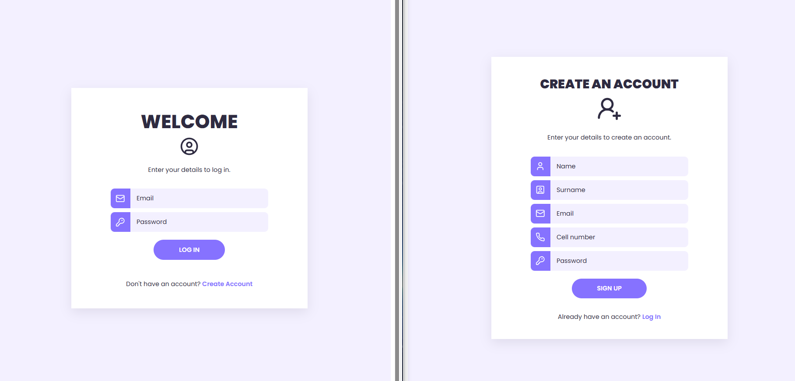
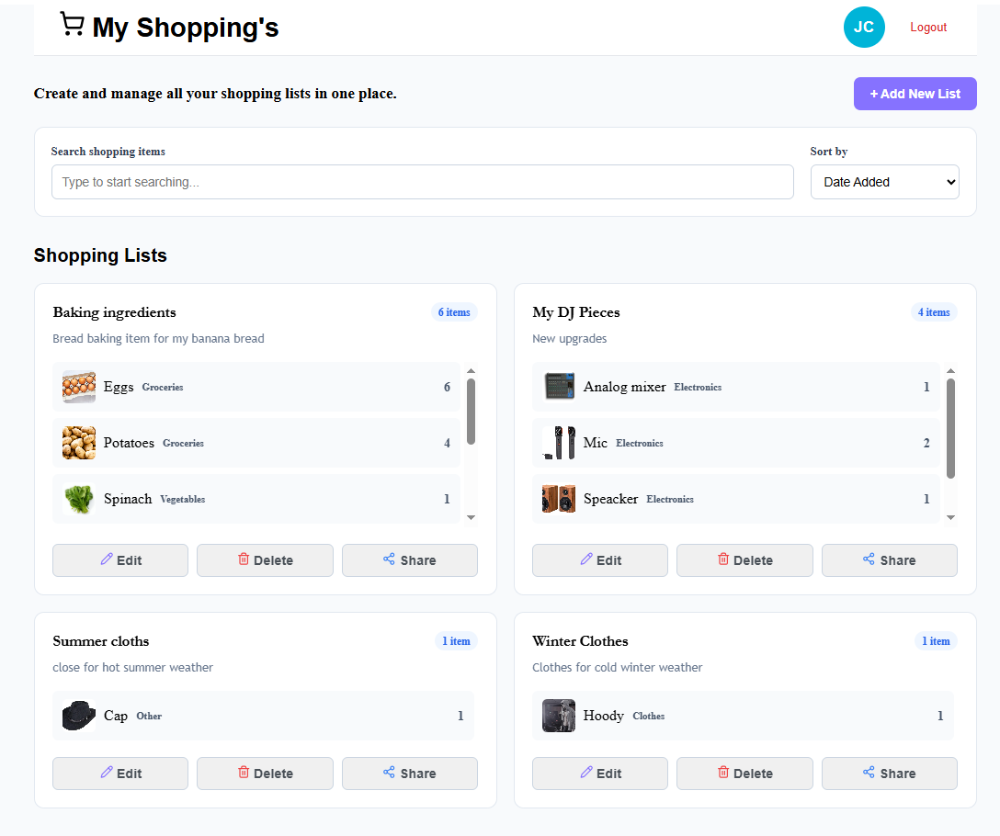
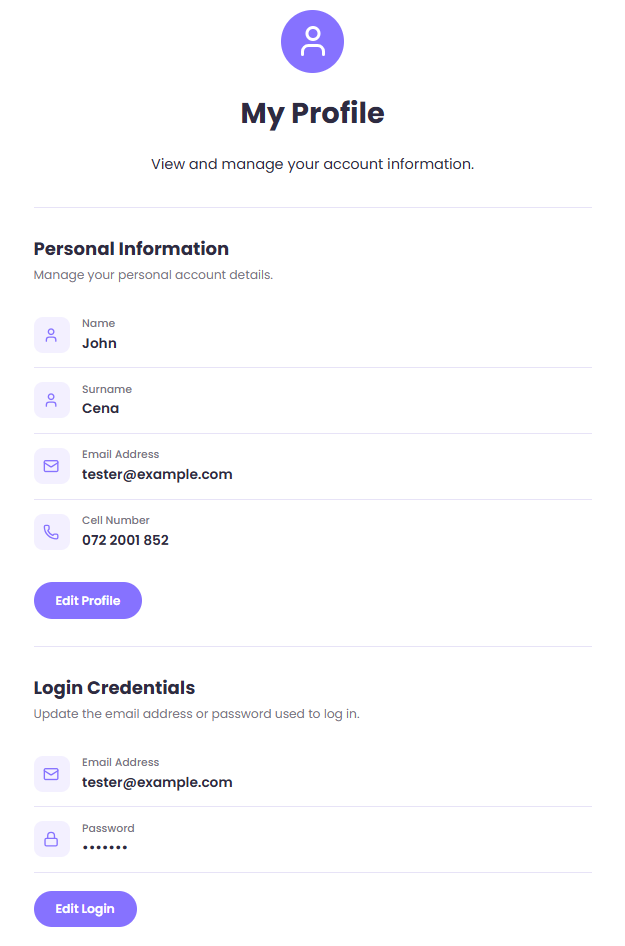

# My Shopping's – Shopping List Application

A responsive shopping list web application built with **React, TypeScript, Vite, Redux Toolkit and JSON Server**.

The application allows users to create an account, log in, manage their profile, create and manage multiple shopping lists, search and sort shopping items, select item images using the Pixabay API, and share shopping lists with other people.

## Application Preview




## Project Overview

The application uses React Router for navigation, Redux Toolkit for application state management, JSON Server for persistent development data, bcryptjs for password hashing, Axios for API communication, and the Pixabay API for adding item images.

The main application flow is:

User
 |
React + TypeScript + Vite
 |
 +--------------------+
 |                    |
Redux Toolkit      React Router
 |                    |
Application State   Page Navigation
 |
Service Layer
 |
 +-------------------------+
 |                         |
JSON Server             Pixabay API
 |                         |
db.json                Item Images

## Features

### User Management

- User registration
- Email address
- Password
- Name
- Surname
- Cell number
- Password hashing using bcryptjs
- User login
- Login validation
- Logout
- Persistent logged-in state using localStorage

### Authorisation

- Protected routes for authenticated users
- Public routes for login and registration

### Profile Management

Users can:
- View ad edit their name, surname, email address, cell number and password

### Shopping Lists

Users can:

- Create multiple shopping lists
- Add optional notes
- Add multiple items
- Set item quantity
- Select an item category
- Select an image for an item
- View their existing shopping lists
- Edit shopping lists
- Add items while editing
- Remove items
- Delete shopping lists

### Search

- Users can search shopping items by name.
- The search keyword is stored in the URL using a query parameter.
- Changing the search parameter updates the displayed shopping items.

### Sorting

Shopping items can be sorted by:
- Name
- Category

### Image Selection

1. Enter an image search term.
2. Search Pixabay.
3. View the returned images.
4. Select an image.
5. Preview the selected image.
6. Add the item to the shopping list.

The same functionality is available when editing a shopping list.

### Sharing

Users can share a shopping list using a generated URL.
The application uses the browser Web Share API where supported. If Web Share is unavailable, the link is copied to the clipboard.
A shared shopping list can be viewed without requiring the recipient to log in.

## Technologies Used

- React: User interface
- TypeScript: Type-safe JavaScript
- Vite: Development and build tooling
- React Router: Application navigation and routing
- Redux Toolkit: Global state management
- Axios: HTTP/API requests
- JSON Server: Development REST API and data persistence
- bcryptjs: Password hashing and password verification
- Pixabay API: Item image searching
- CSS Modules: Component/page-specific styling
- Lucide React: React Icons, User interface icons
- localStorage: Persisting the logged-in user


## Application Pages

### 1. Login Page

- Users enter their email address and password to log in.

### 2. Registration Page

- User enter their information to create an account to use the app.

Users provide:
- Name
- Surname
- Email
- Cell number
- Password

### 3. Home Page

The home page is the main shopping-list dashboard.
Users can:

- Add a new shopping list
- View existing lists
- Search items
- Sort items
- Edit lists
- Delete lists
- Share lists

### 4. Profile Page

Users can view and manage their personal information and login credentials.


### 5. Shared Shopping List

This page displays a shopping list using the ID contained in the URL.

## Shopping List Management

The application implements CRUD operations.

### Create

A user can create a shopping list containing:
- List name, Notes, Multiple items, Quantity, Category, Image

### Read

The application loads shopping lists belonging to the currently logged-in user from JSON Server.

### Update

Users can edit:
- List name, Notes, Items, Item quantity, Item category, Item image,

### Delete

Users can delete a shopping list. Items can also be removed from a list.

## Data Storage

JSON Server is used as the REST API during development.

The application communicates with endpoints such as:

GET    /users
POST   /users

GET    /shoppingLists
POST   /shoppingLists
PUT    /shoppingLists/:id
DELETE /shoppingLists/:id
GET    /shoppingLists/:id
 

## Installation

Clone the repository:

```bash
git clone YOUR_GITHUB_REPOSITORY_URL

Move into the project directory:

```bash
cd your-project-folder

Install dependencies:

```bash
npm install
```

## Running the Application

The project requires both the React development server and JSON Server.

### Start JSON Server

From the project root:

```bash
npx json-server --watch db.json --port 3001
```

JSON Server will be available at:

```text
http://localhost:3001
```

### Start React/Vite

Open another terminal and run:

```bash
npm run dev
```

The React application will normally be available at:

```text
http://localhost:5173
```
### Author
- Malesela Phineas Ngoasheng

### Acknowledgements

- Design structure and CSS styling of Register, Login and Profile pages was inspired by [Coding2GO](https://www.youtube.com/@Coding2GO)'s YouTube tutorial: [Login & Signup with HTML, CSS, JavaScript (form validation)](https://youtu.be/bVl5_UdcAy0?si=m0RR3iAWZQaNt3N5).
